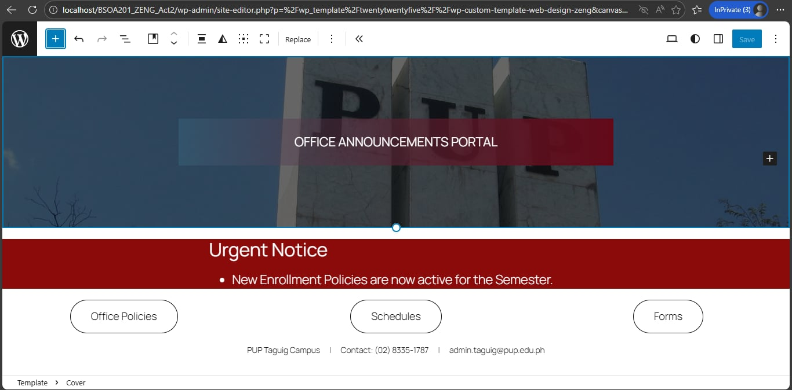

WebDesign-Lab3-YeXiaZeng

Homepage Mock-up

Short Reflection

1. What color choices did you make and why?
I chose a deep maroon for the primary branding to align with the professional identity of the institution. I used high-contrast red for the "Urgent Notices" section to immediately capture the attention of officers regarding important updates.

2. How did you apply accessibility fixes?
I ensured that all text placed over images used a dark overlay to maintain a high contrast ratio. Additionally, I used large, bold sans-serif typography for headings to ensure readability for all users, including those with visual impairments.

3. What challenges did you face?
One major challenge was resolving the local server error that prevented JPEG uploads. I also had to navigate Git merge conflicts when syncing my local repository with the GitHub remote branch for the first time.
